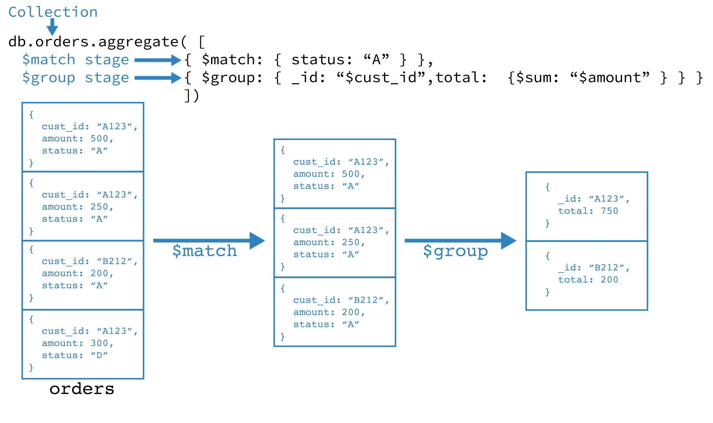

# Khái niệm
- Aggregation là một framwork dùng để xử lý, tổng hợp dữ liệu của mongoDB. Aggregation được xây dựng dựa trên mô hình xử lý dữ liệu dạng `pipeline` (đường ống)
- `Pipeline` là một chuỗi các `stage`, trong một `stage`, chúng ta sử dụng các Aggregation operator để tìm kiếm, chỉnh sửa, biến đổi dữ liệu của các `input document`
- Các `output document` của stage phía trước sẽ là `input document` của stage ngay sau

    ## Cú pháp
    - MongoDB cung cấp phương thức db.collection.aggregate() để chạy aggregation pipeline.
        ```js
        db.userCollection.aggregate( [ { <stage 1> }, { <stage 2> }, ..., { <stage N> } ], { <options> } );
        ```
        Trong đó:
        - Các `stage` được đặt trong một array theo thứ tự thực hiện trước sau.
        - Các `option` là tùy chọn, không nhất thiết phải có.
    ## Rule
    - `Pipeline` luôn là một mảng chứa một hoặc nhiều `stage`
    - Các `stage` bao gồm 1 hoặc nhiều `aggregation operators` hoặc `expressions`
# Ví dụ
Chúng ta có collection Orders như hình dưới đây với các trường 
```js
{
    cust_id: String,
    amount: Number,
    status: String
}
```

Với câu lệnh dưới đây bao gồm 2 `stage`
```js
db.orders.aggregate([
   { $match: { status: "A" } },
   { $group: { _id: "$cust_id", total: { $sum: "$amount" } } }
])
```
- `Stage 1`: [$match](https://docs.mongodb.com/manual/reference/operator/aggregation/match/#pipe._S_match) stage lọc các document có trường `status: "A"` và đẩy kết quả `output document` cho `Stage 2`. `$match` tương tự như WHERE và HAVING trong SQL
    - cú pháp: 
    ```js
    { $match: { <query> } }
    ```
```js
// Output document of Stage 1
[
    {
        cust_id: "A123",
        amount: 500,
        status: "A"
    },
    {
        cust_id: "A123",
        amount: 250,
        status: "A"
    },
    {
        cust_id: "B212",
        amount: 200,
        status: "A"
    }
]
```
- `Stage 2`: [$group](https://docs.mongodb.com/manual/reference/operator/aggregation/group/#pipe._S_group) stage nhóm các trường thành một `output document` mới gồm 2 trường `_id` = `$cust_id` và trường `total` = tổng giá trị các trường `amount` của `$cust_id` tương ứng giống nhau  từ `output document` của `Stage 1`
    - cú pháp: 
    ```js
        { $project: { <specification(s)> } }
    ```

```js
// Output document of Stage 1
[
    {
        _id: "A123",
        total: 750,
    },
    {
        cust_id: "B212",
        amount: 200,
    }  
]
```

# Quiz
[Quiz 1 - The concept of pipelines](/m121-aggregation-framework/0-introduction/quiz-answer/quiz-1.md)

[Quiz 2 - Aggregation Structure and Synctax](/m121-aggregation-framework/0-introduction/quiz-answer/quiz-2.md)