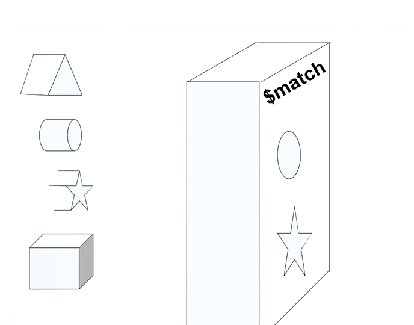

# Nội dung
Phần này gồm các nội dung sau
- [`$match`: Filtering Documents](#$match)
- [`$project`: Shaping documents](#$project)
- Lab 1 - Changing Documents Shape with `$project`
- Lab 2 - Computing Fields


## $match
### Định nghĩa
> Filters the documents to pass only the documents that match the specified condition(s) to the next pipeline stage.
`$match` được sử dụng với mục đích lọc các document mà trùng với điều kiện cụ thể. 

Ví dụ như hình dưới đây, `$match` sẽ chỉ cho phép hình tròn và hình ngôi sao đi qua. `output document` sẽ là tập hình tròn và hình ngôi sao



- cú pháp: 
    ```js
    { $match: { <query> } }
    ```
- `$match` nên được sử dụng ở ngay đầu `Aggregation Stage` nhắm lọc và giới hạn lượng dữ liệu, giảm thời gian xử lý dữ iệu ở các `Stage` sau.
- `$match` sử dụng cú pháp truy vấn tương tự như truy vấn tìm kiếm

### Ví dụ: 
<details>
<summary> Xem chi tiết </summary>

```js
[{
        "_id": ObjectId("512bc95fe835e68f199c8686"),
        "author": "dave",
        "score": 80,
        "views": 100
    },

    {
        "_id": ObjectId("512bc962e835e68f199c8687"),
        "author": "dave",
        "score": 85,
        "views": 521
    },

    {
        "_id": ObjectId("55f5a192d4bede9ac365b257"),
        "author": "ahn",
        "score": 60,
        "views": 1000
    },

    {
        "_id": ObjectId("55f5a192d4bede9ac365b258"),
        "author": "li",
        "score": 55,
        "views": 5000
    },

    {
        "_id": ObjectId("55f5a1d3d4bede9ac365b259"),
        "author": "annT",
        "score": 60,
        "views": 50
    },

    {
        "_id": ObjectId("55f5a1d3d4bede9ac365b25a"),
        "author": "li",
        "score": 94,
        "views": 999
    },

    {
        "_id": ObjectId("55f5a1d3d4bede9ac365b25b"),
        "author": "ty",
        "score": 95,
        "views": 1000
    }
]
```
Chúng ta sẽ sử dụng `$match` để thực hiện một truy vấn lọc đơn giản
```js
db.articles.aggregate(
    [ { $match : { author : "dave" } } ]
)
```
`$match` lọc các document có trường `author` - `"dave"`, kết quả chúng ta được các document như dưới đây
```js
[{
        "_id": ObjectId("512bc95fe835e68f199c8686"),
        "author": "dave",
        "score": 80,
        "views": 100
    },
    {
        "_id": ObjectId("512bc962e835e68f199c8687"),
        "author": "dave",
        "score": 85,
        "views": 521
    }
]
```
</details>


### Quiz
[Quiz 1 - $match: Filtering documents](/m121-aggregation-framework/1-basic-aggregation/quiz-answer/quiz-1.md)
### Lab
[Lab1 1 - $match: Filtering documents](/m121-aggregation-framework/1-basic-aggregation/lab/lab1-$match.md)

## $project
### Định nghĩa
> "Passes along the documents with the requested fields to the next stage in the pipeline. The specified fields can be existing fields from the input documents or newly computed fields."

`$project` được dùng để chỉ định các trường sẽ xuất hiện trong `output document`. Đó có thể là các trường đã tồn tại trong `input document` hoặc có thể là các trường được tính toán mới dựa trên đầu vào.
 `$project` tương tự như `SELECT` ở trong SQL.

- cú pháp: 
    ```js
    { $project: { <specification(s)> } }
    ```
- Trừ trường `_id`, các trường khác nếu muốn xuất hiện ở `output document` thì cần phải chỉ định rõ trong `$project`
- `$project` có thể được sử dụng nhiều lần bên trong `Aggregation pipeline`
- `$project` có thể sử dụng để tính toán gán lại giá trji một trường tồn tại trong `input document` 
### Ví dụ:
<details >
<summary> Xem chi tiết </summary>

Chúng ta sẽ sử dụng Aggregation Framwork trên document `books` sau đây

```js
{
  "_id" : 1,
  title: "abc123",
  isbn: "0001122223334",
  author: { last: "zzz", first: "aaa" },
  copies: 5
}
```
Chúng ta sử dụng `$project` để tạo một `output document` mới bao gồm các trường `_id`, `title`, `author` 
```js
db.books.aggregate( [ { $project : { title : 1 , author : 1 } } ] )
```
Chúng ta được kết quả như sau
```ks
{ 
    "_id" : 1, 
    "title" : "abc123", 
    "author" : { "last" : "zzz", "first" : "aaa" } 
}
```
</details>
